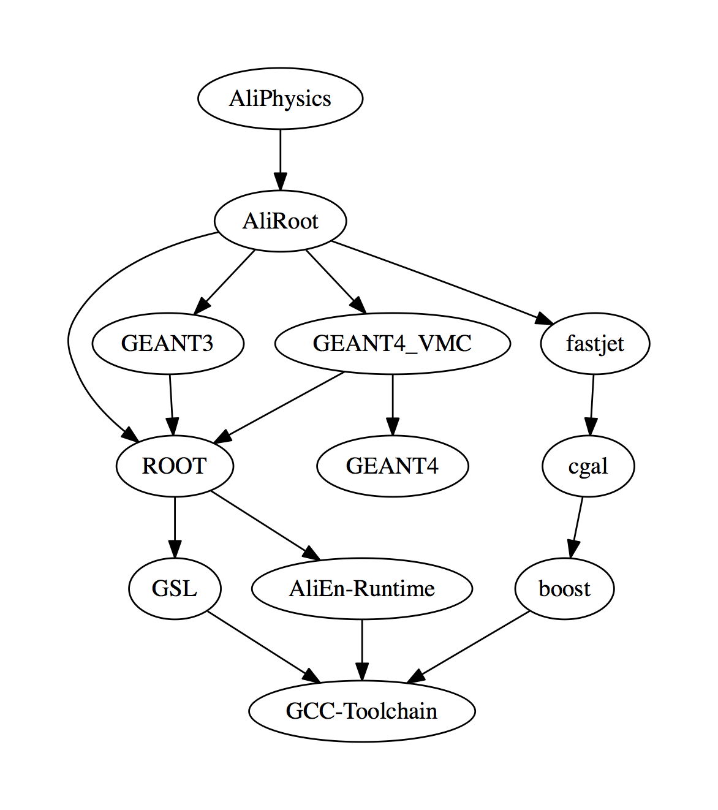

ALICE has been using since some months a novel build tool for the centralized
builds (*i.e.* the software you will find on the Grid and/or CVMFS).

This tool developed by the Offline is called `aliBuild` and has an exhaustive
[user manual](https://alisw.github.io/alibuild).

Being a simple Python script with a clear syntax and handy development options,
`aliBuild` can be run on your laptop and does not need any complex or
specialized infrastructure for being executed.

After some years of service time has come to send `alice-env.sh` and the
"automatic installer" to retirement: we are now deprecating them and proposing
`aliBuild` for building ALICE software locally.


Rationale
---------

We know that all migrations bring headaches and disrupt workflows, no matter how
easy they are. There are however good reasons behind this migration.

* The old build scripts were effectively limited to a bunch of software:
  AliPhysics, AliRoot, ROOT, etc.: we needed a tool that was more extensible in
  order to support a wider range of software, *e.g.* all our forthcoming
  generators, or, simply, Geant4.

* We needed a single tool which we could use both for our centralized builds and
  for personal use. This way it is easier to provide support and fixes.

* The old automatic installation method mixed the software build rules inside
  the installation script itself. Once again, for extensibility reasons, we
  wanted to move to a system that keeps the rules we use to build software
  separated from the code.

* Builds produced with the old system could be inconsistent. For example,
  AliRoot depended on ROOT, but we did not enforce an AliRoot rebuild when ROOT
  changed. We wanted a system that handles dependencies clearly, and
  automatically decides what to rebuild depending on what has changed.

* Not all software combinations are compatible. The old system gave complete
  freedom to specify any desired software combination. We needed a system that
  retained this liberty only if needed, but by default uses what *we* know it
  works.

* We needed a single tool to compile current ALICE software and O2.


So, what is a "build tool", for starters?
-----------------------------------------

`aliBuild` is a "build tool". A "build tool" is a binary cook that produces
built software packages based on a cookbook of recipes.

To be clear, a build tool is not like CMake, or Makefiles. It is the exact set
of commands you would run manually to get from the source code, to the binary
installation.

In practice:

> build tool + build recipes + source code = built software


Instant gratification
---------------------

Install aliBuild:

```bash
pip install alibuild
```

Depending on your system configuration you will find `aliBuild` in your path.

Install a tagged version of AliRoot, and AliPhysics master, and all their
dependencies:

```bash
mkdir $HOME/alice && cd $HOME/alice
aliBuild init AliRoot,AliPhysics -z ali-master
cd ali-master
aliBuild -z -w ../sw -d build AliPhysics
alienv enter AliPhysics/latest-ali-master
```

These lines should be sufficient to download all the software from scratch,
build it for your system and enter an environment for using it.

The lines above will download AliRoot and AliPhysics master. If you want a
specific version you can use the following syntax:

```bash
aliBuild init AliRoot@<desired_aliroot_ver>,AliPhysics@<desired_aliphysics_ver> -z ali-master
```

> aliBuild will **not** update your AliRoot/AliPhysics installation: how to
> update [is explained later on](#get_updates_for_aliroot_and_aliphysics).


### What have we done here?

```bash
mkdir $HOME/alice && cd $HOME/alice
```

All our ALICE software will be contained under this directory. This means that
it is sufficient to get rid of it to completely remove all traces of ALICE
software (install, build, source directories) from your system.

```bash
aliBuild init AliRoot,AliPhysics -z ali-master
```

We are telling `aliBuild` to initialize a directory called `ali-master` (the
name is arbitrary) containing a defined software combination. This is similar
to what a "tuple" was in the old system, and roughly equivalent to the following
`alice-env.conf` syntax:

```bash
AliTuple[1]='root=v5-34-08 aliroot=master aliphysics=master'
```

with a notable difference: you specify only the versions of the software you
develop (AliRoot and AliPhysics), the others are set automatically. Another
difference is that you are giving your tuple a name (`ali-master`).

The following variant:

```bash
aliBuild init AliRoot@<desired_aliroot_ver>,AliPhysics@<desired_aliphysics_ver> -z ali-master
```

corresponds to:

```bash
AliTuple[1]='root=v5-34-08 aliroot=<desired_aliroot_ver> aliphysics=<desired_aliphysics_ver>'
```

After running the command with no specified versions, we will find under
`ali-master` the following three directories:

```
+ ali-master
|
\-+- alidist     # the software recipes
  |
  +- AliRoot     # Git source, master checked out
  |
  \- AliPhysics  # Git source, master checked out
```

For the moment let's ignore the software recipes (`alidist`) and consider the
other two. These are normal Git clones, you can `cd` into them and
`git checkout` whatever you want. In particular, after the first initial
preparation done by `aliBuild init`, you should keep them up-to-date by hand.
For instance, you'll have to `git pull --rebase` in AliPhysics to get the latest
update.

> In this example, AliRoot and AliPhysics are what we will call our
> **development packages**.

Now, we did not download any other software dependency (such as AliEn, or ROOT).
This does not mean they won't be built. They will be, but `aliBuild` will be
doing the right thing and download the correct versions of your dependencies.

This system allows you to concentrate on the code you need to develop (in most
cases it's actually AliRoot and AliPhysics), and leave the working directory
uncluttered from the rest.

> It is easy to add other packages to the syntax above if you need to work on
> their source code too (for instance, ROOT).

Please note that `aliBuild` will consider a package being in "development mode"
whenever it finds sources checked out in the current directory under
`$PackageName` (*e.g.*, `AliPhysics`) - please respect the case.

You can in principle clone such sources manually with an ordinary `git clone`,
but there is an advantage in using `aliBuild init`: a considerable amount of
space is going to be saved, more or less the same way we suggested to use
`git-new-workdir` in the past. The actual working directory will be there as
usual, but the big part of the Git repository (the "objects storage") will be
saved inside `sw/MIRROR/packagename` (*e.g.* `sw/MIRROR/aliphysics`) as a bare
repository and will be shared by all local checkouts of the same package created
via `aliBuild init`.

The big difference in operations with respect to `git-new-workdir` is that you
can have multiple checkouts of the same branch without Git getting confused and
altering your working directory.

> Please note that if you remove `sw/MIRROR/packagename` all the local checkouts
> are going to be broken!

```bash
cd ali-master
```

Enter our "tuple" directory.

```bash
aliBuild -z -w ../sw -d build AliPhysics
```

Build the AliPhysics package. This will build all its dependencies too. For the
full list of `aliBuild` options do `aliBuild --help` or
[consult the manual](https://alisw.github.io/alibuild). The options we've used:

* `-z`: tells `aliBuild` to append this directory's name to AliRoot and
  AliPhysics. This way, AliRoot and AliPhysics created using the source code
  contained in `ali-master` (our working tuple) will be named
  `AliRoot@latest-ali-master` and `AliPhysics@latest-ali-master`. We will see
  later how this feature is useful when loading the appropriate environment.

* `-w ../sw`: this is the shared `aliBuild` working directory. It is shared in
  the sense that all possible tuples will write there all build artifacts, and
  all software will be installed there. The content of this directory should not
  be changed manually. Note that identical software for multiple tuples (*e.g.*
  same version of ROOT or AliEn) is reused thanks to this shared directory.

* `-d`: debug mode, be verbose. Facilitates finding errors by seeing what is
  going on in the build process (including warnings).

```bash
alienv enter AliPhysics/latest-ali-master
```

Enters the environment of the just-generated AliPhysics build. As we have
already pointed out, the use of `-z` while building this version is what
appended `latest-ali-master` to the name in a way that we can identify it.

Note that `alienv enter` works the same way as the `alienv` script found on
CVMFS: it will open a new shell, with the correct environment for executing
AliPhysics loaded. This also includes all its dependencies. You can go back to
the original environment by simply typing `exit` in this subshell (just like on
CVMFS).


Install aliBuild
----------------

Stable `aliBuild` installations can be "pipped" on all systems having `pip` by
running:

```bash
pip install alibuild
```

If performed as root, the installation is done system-wide and the `aliBuild`
and `alienv` commands will likely be found in your `$PATH` out of the box. If
not performed as root you might need to add some variables to your `$PATH`.


### Upgrade aliBuild from pip

If installed with `pip`, `aliBuild` can be upgraded with:

```bash
pip install --upgrade alibuild
```


### Getting aliBuild from GitHub

If you want to use an unstable version of `aliBuild`, or you want to contribute
to it, you can get [aliBuild from GitHub](https://github.com/alisw/alibuild):

```bash
cd $HOME/alice
git clone https://github.com/alisw/alibuild
```

and then you can directly use `aliBuild` and `alienv` from
`$HOME/alice/alibuild`:

```bash
$HOME/alice/alibuild/aliBuild
$HOME/alice/alibuild/alienv
```


### Install environment modules

In order to use `alienv` you need to install Environment Modules. This is simply
done for instance:

* On Ubuntu: `apt-get install environment-modules`
* On Red Hat systems: `yum install environment-modules`
* On OSX: `brew install modules`


Work on a "tuple"
-----------------

### Get updates for AliRoot and AliPhysics

Let's imagine that the base AliRoot version has changed. Say we have previously
checked out AliRoot version `vX-YY-ZZ`:

```bash
aliBuild -z ali-master init AliRoot@vX-YY-ZZ,AliPhysics
```

and we now want to use the updated `master`.

We do:

```bash
cd $HOME/alice/
cd ali-master/
cd AliRoot/
git checkout master
git pull
```

to checkout the master branch and download all the updates. If we want to check
out a specific tag different from the initial one:

```bash
cd $HOME/alice/
cd ali-master/
cd AliRoot/
git fetch && git remote update -p
git checkout vAA-BB-CC
```


### Make changes

Now, let's modify something in AliPhysics, commit it, download other people's
changes, and push our commit:

```bash
cd $HOME/alice/
cd ali-master/
cd AliPhysics/
# edit my files
git commit -a -m 'Modify some files'
git pull --rebase
git push
```

Note that at the `git commit` part, Git might correctly point out that you did
not set up properly your user and email. Do:

```bash
git config user.name your_cern_username
git config user.email 'your.email@cern.ch'
```

> It is recommended not to use the `--global` flag to keep the settings per
> repository.


### Rebuild using aliBuild

From the `ali-master` directory we can simply fire `aliBuild` **the same way we
did it the first time**:

```bash
aliBuild -z -w ../sw -d build AliPhysics
```

This will go through the process of rebuilding only what changed. Since nothing
changed in, for instance, ROOT or AliEn, they will not be touched. Only AliRoot
and AliPhysics will effectively be rebuilt.

In case of problems you can consult each package's build log. For AliPhysics
built in `ali-master`, this will be:

```
$HOME/alice/sw/BUILD/AliPhysics-latest-ali-master/log
```


### Where is my build directory?

Instead of using `aliBuild`, you can simply rerun `make` or other commands
manually from the build directory.

The build directory for our version of AliPhysics will be stored in
`$HOME/alice/sw`, so you can do:

```bash
cd $HOME/alice/sw/BUILD/AliPhysics-latest-ali-master/AliPhysics/
make -j50 install
```

and the software will be available with `alienv` as before.

> Rebuilding manually saves some time during development, but it is better to
> run `aliBuild` as explained in the previous paragraph right before pushing
> your code to make sure it really works.


### Rebuild an entire tuple

We do not have any longer the concept of rebuilding a "tuple". Instead, we build
the toplevel package, which has a certain number of dependencies, which will all
be rebuilt *only if strictly necessary*.

In our case, AliPhysics is the toplevel package.

If you made a change in AliRoot, and tell aliBuild to rebuild AliPhysics, both
AliRoot and AliPhysics will be rebuilt, as AliPhysics depends on the former.


### Developing other packages

`aliBuild` will automatically download the source code with the correct version
for every package it builds, except when it finds in the current directory a
directory called like the package name. In our case, `aliBuild` will not
attempt to redownload AliRoot and AliPhysics as it finds the two clones already
there (as they were prepared with `aliBuild init`).

The example above has only AliRoot and AliPhysics. If we want to add ROOT, for
instance, we would do:

```bash
cd $HOME/alice
aliBuild init ROOT -z ali-master
```

This will add a ROOT clone inside the `ali-master` directory.


Software recipes
----------------

The major difference between the old build system and `aliBuild` is that we keep
the sequence of commands we run to build a piece of software in a separate
place.

Those sequences of commands are called **recipes** and we keep them on GitHub on
a repository called [alidist](https://github.com/alisw/alidist).

If you go there, you will see that each package has its own recipe called
`packagename.sh`. If you open one of them you will see that they are shell
scripts (more precisely, Bash) with a small header containing metainformation
which is quite intuitive.

Let's open the `root.sh` file (directly from
[here](https://github.com/alisw/alidist/blob/IB/v5-08/prod/root.sh)).

The header is in [YAML format](https://en.wikipedia.org/wiki/YAML). Interesting
parts:

```yaml
package: ROOT
version: "%(tag_basename)s-alice%(defaults_upper)s"
tag: alice/v5-34-30
source: https://github.com/alisw/root
requires:
  - AliEn-Runtime
  - GSL
```

It's intuitive to understand most fields. The full explanation of all supported
fields [is available](http://alisw.github.io/alibuild/reference.html). At a
first glance we notice that the header comprises a package name (`package:`),
the source code (`source:`) and a version (`tag:`). Dependencies are a list
called `requires:`.


### What version is used for the development packages?

In this case, we are taking ROOT from [our custom
repository](https://github.com/alisw/root), where we backport patches when
needed.

The `tag:` field tells us that we are checking out `alice/v5-34-30`. This is
the ROOT version that will be used **in case ROOT is not one of the development
packages**, *i.e.* in case we did not prepare an editable ROOT clone by means of
`aliBuild init`.

In case we want to develop ROOT (*i.e.*, ROOT becomes a development package):

```bash
cd $HOME/alice
aliBuild init ROOT -z ali-master
```

then by default a ROOT clone is created under `ali-master`, and **the version
specified in the recipe is checked out**, *i.e.* `alice/v5-34-30`. If you want
to override this, you can tell `aliBuild init` to checkout something different:

```bash
aliBuild init ROOT@master -z ali-master
```

or, you move into the ROOT directory and you do it with `git` commands:

```bash
cd $HOME/alice
cd ali-master/ROOT/
git checkout master
git pull
git checkout -b my-new-root-feature
```

When `aliBuild build` finds the ROOT directory, it will use it as-is, with the
sources provided there, and this effectively overrides whatever `tag:` version
is specified within the recipe.


### Body of the recipe

The body of each recipe contains a sequence of shell commands that will be
executed to produce the package.

The execution stops if any command returns nonzero.

The script is executed within an environment where all the various `$PATH`, etc.
of all its dependencies are set. The working directory is the build directory.
There is a number of variables set by `aliBuild`, such as `$INSTALLROOT` for the
installation directory, or `$SOURCEDIR` for the source directory. All the
available variables are defined
[here](http://alisw.github.io/alibuild/reference.html).


### Modulefiles generation

The `alienv` environment management script uses
[Environment Modules](http://modules.sourceforge.net/) to manage the
environment.

Every new package must generate a "modulefile" for this to work. This has to end
under `$INSTALLROOT/etc/modulefiles/$PKGNAME`.

Modulefile generation is part of the recipe and it is done via normal shell
scripts.


### Incremental recipes

Some packages, like
[AliPhysics](https://github.com/alisw/alidist/blob/IB/v5-08/prod/aliphysics.sh),
contain in the header a small section called `incremental_recipe:`.

This is a short version of the recipe executed when *rebuilding* a package in
development mode (the first time the *full* recipe is executed).


### Recipes versioning and updates

Recipes are in a Git repository called
[alidist](https://github.com/alisw/alidist), which does not have a master
branch. Instead, it has branches whose names are like:

* `IB/v5-08/prod`
* `IB/v5-08/next`

Let's break down the name to understand their meaning.

* `IB` stands for
  [integration builds](https://en.wikipedia.org/wiki/Continuous_integration).
* `v5-08` says that this recipe set is good for producing all AliRoot v5-08-XX
  builds (and corresponding AliPhysics).
* `prod` says that this recipe set is what is currently being used in
  production: all software on the Grid has been produced using a `prod` flavor.
* `next`, conversely, says that this is a "development branch" which is by no
  means ready for production. `next` branches change continuously, and when we
  are satisfied with the changes, we merge them to `prod` and they will become
  the new production branch.

Note that we currently run two automatic builds per day of AliPhysics/AliRoot
master by using the `next` branch for testing - but on the Grid we use the
`prod` branches.

When preparing a tuple with:

```bash
aliBuild init AliPhysics -z ali-master
```

the current *stable* version of the recipes is downloaded under
`ali-master/alidist`. If you want, you can explicitly download the development
recipes set:

```bash
aliBuild init AliPhysics -z ali-master --dist IB/v5-08/next
```

or, just `cd` into `ali-master/alidist` once downloaded and checkout the desired
branch.

We periodically update the recipes, and you will need to *manually* download
such updates. For instance, if we migrate from AliRoot v5-08-XX to v5-09-YY the
production branch will change:

```bash
cd $HOME/alice/ali-master/alidist
git fetch
git checkout IB/v5-09/prod
```

or, if you want to make sure you did not miss an update:

```bash
cd $HOME/alice/ali-master/alidist
git pull
```

> Remember that built software is defined by the sources, and the recipes! If a
> recipe changes, the corresponding software and all software depending on it
> will be rebuilt!

Concerning the rebuild of packages, this is the reason why we leave to you the
update of the software recipes. A simple example: if a small change is made in
some bottom-level package like AliEn, and you pick it with `git pull`, then
nearly all packages need to be rebuilt the next time you run `aliBuild`!

Advice: update your software recipe repository only when:

* The AliRoot minor version changes (*e.g.* v5-08 to v5-09)
* Some recipe did not work on your system and a fix has been committed
* You want to keep your installation up-to-date and you are prepared to lose
  some time (or, you run it before going to sleep)


### Develop a recipe

If you want to modify an existing recipe, you need to fork
[alidist](https://github.com/alisw/alidist) in your GitHub. If you have some
changes, make a pull request from your repository to `alidist` to the current
`next` branch and not the `prod` one.

All discussions, comments, etc. will happen on GitHub. You can find an example
of a pull request to `alidist`
[here](https://github.com/alisw/alidist/pull/275).

Note that the main [alidist page](https://github.com/alisw/alidist) welcomes you
with a documentation on how to write a new recipe and how to handle external
software.


Dependencies and system packages
--------------------------------

If you want to know what are the dependencies of a given software, a tool called
`aliDeps` is available in the
[aliBuild repository](https://github.com/alisw/alibuild) to generate a graph.

If we look at the dependency tree for AliPhysics (the most common toplevel
package), we will see plenty of packages:




### Disabling unneeded packages

Apart from some relatively small externals (like `cgal` or `GSL`), you might be
seeing some packages that you don't need. If you don't want GEANT3, GEANT4 and
fastjet, you can build your software with:

```bash
aliBuild -z -w ../sw -d build AliPhysics --disable GEANT3,GEANT4_VMC,fastjet
```

and the compilation will surely be faster for you.


### Packages from the system

In most cases you would not want to recompile a package which is available from
your Linux distribution or from Homebrew on OSX. For instance, you might see
`boost`, which you would commonly install with `yum` or `apt-get`.

Recipes have a small section called `prefer_system_check:` that contains a
script that determines whether the system version of a package can be used, thus
preventing to run the recipe in order to prefer the system version. If the
script returns 0 (success), then the system version is used.

If you want to know in advance what packages can be used from the system for
building AliPhysics just run from a directory containing the recipes:

```bash
aliDoctor AliPhysics
```

This will give you a detailed list of packages that could not be picked up from
the system along with hints on what do to in order to install them.

In most cases recipes are configured to pick as much as possible from the
system. What packages are picked from the system, which ones are compiled and
which others are in development mode are printed out at the very beginning
of the build process (`aliBuild build`). For AliPhysics in the `ali-master`
example above, on a recent Ubuntu installation, this gives the following
summary:

```
==> The following packages will be picked up from the system:

    - CMake
    - libxml2
    - zlib
    - OpenSSL
    - GCC-Toolchain
    - autotools

    If this is not you want, you have to uninstall / unload them.

==> The following packages will be build by aliBuild because they couldn't be picked up from the system:

    - SWIG
    - boost

    This is not a real issue, but it might take longer the first time you invoke aliBuild.
```


Manage the environment
----------------------

Environment management is done in a very different way with respect to
`alice-env.sh`. The main difference is that you don't need to "source" the
environment in order to build the software with `aliBuild`, and you don't have
"tuples" anymore: you simply select a toplevel package, and all its dependencies
will be loaded automatically.

This behavior is identical to what you would do on CVMFS or on the Grid.


### Install the environment script helper

If you have installed `aliBuild` either with `pip` or by cloning from GitHub,
you can add the following lines to your `~/.bashrc` in order to make easier to
load and unload the environment in the current shell:

```bash
ALICE_WORK_DIR=$HOME/alice/sw
eval "`alienv shell-helper`"
```

> The command is enclosed in **double quotes** and **backticks**!

Set the `ALICE_WORK_DIR` variable to the location of your `sw` directory. The
example above sets the directory to what we have used so far.

Although it is not mandatory to do that, there are two advantages:

1. You can use the `alienv load` and `alienv unload` commands for loading the
   environment in your _current_ shell directly, without wrapping them in an
   `eval` directive _(see later on)_.
2. You can run the `alienv` command from whatever directory you are in: you do
   not need to `cd` in the ALICE software directory first.

Once you have changed your shell configuration you must close and reopen your
terminal.

> The following shells are supported by the `alienv` helper: Bash, ZSH, KSH,
> POSIX sh. C shells are not supported.

The full guide is available by simply typing `alienv help`, and [here](http://alisw.github.io/alibuild/quick.html) too.


### List available packages

To list all available packages do `alienv q`. This command supports
case-insensitive filters, *e.g.* for listing all available AliPhysics packages
only:

```bash
alienv q aliphysics
```


### Enter a new environment shell

To enter a new shell with the correct environment loaded, do:

```bash
alienv enter AliPhysics/latest-ali-master
```

or the correct package name. All the dependencies are set automatically. This is
a new shell and it can be exited by typing `exit`. At any moment you can see the
list of loaded packages by using:

```bash
alienv list
```

Note that this method will ignore and override all your settings in your current
`~/.bashrc` (or the equivalent for the shell you are using). This is to avoid
any possible interference with `PATH`, `LD_LIBRARY_PATH`, etc. that you might
have set there.

> You can still load the environment in your _current_ shell as opposed to
> opening a new one, see the next paragraph.


### Load the environment in your current shell

If you prefer to load the environment in the current shell, and you are loading
the `alienv` helper in your `.bashrc`, you can type:

```bash
alienv load AliPhysics/latest-ali-master
```

to load the package in the *current* environment. Check the loaded packages
with `alienv list`. To unload the package (and its dependencies too):

```bash
alienv unload AliPhysics/latest-ali-master
```


### Execute a single command with the right environment

You can even execute a single command with the correct environment without
altering your current shell:

```bash
alienv setenv AliPhysics/latest-ali-master -c aliroot -b
```

> This is useful for **scripting**: you can alter the environment only for the
> commands that need it and leave the rest clean.


Example: compile ROOT 6
-----------------------

As an example of how to use `aliBuild` we can try to compile ROOT 6. Since
ROOT 6 is not used by ALICE in production, we keep the ROOT 6 compatible recipes
in a separate `alidist` branch called `IB/master/root6`.

Let's init the environment for ROOT 6 in a directory called `root6`:

```bash
cd $HOME/alice
aliBuild init ROOT --dist IB/master/root6 -z root6
```

Let's move there, and compile:

```bash
cd root6
aliBuild -z -d -w ../sw build ROOT
```

When ready we can use it with:

```bash
alienv enter ROOT/latest-root6
```

and then type `root` at the prompt.

Since ROOT by default is downloaded from the ALICE mirror, which only constantly
updates the ALICE patch branches we need for production, it is convenient to
also point the ROOT clone we have created to the *official* repository by adding
another "remote" in Git (we'll call it `upstream`, while ours is called
`origin`):

```bash
cd $HOME/alice/root6/ROOT
git remote add upstream https://github.com/root-mirror/root
git checkout master
git pull --rebase upstream master  # get changes from the official repo
```

After we've done that we can use the `aliBuild` command to build it.


Resources
---------

* [Software recipes](https://github.com/alisw/alidist)
* [aliBuild](https://github.com/alisw/alibuild)
* [aliBuild documentation](https://alisw.github.io/alibuild)
