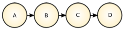
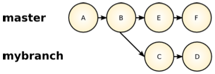
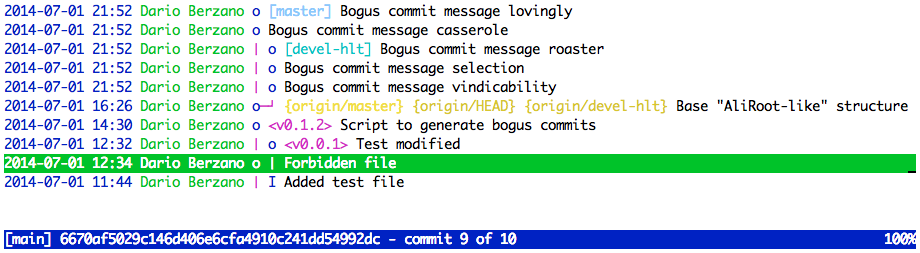

Git is "complicated"
--------------------

[Git](http://git-scm.com/) is a very powerful Version Control System:
many important projects use it (*e.g.* the
[Linux Kernel](http://git.kernel.org/cgit/linux/kernel/git/torvalds/linux.git)).

Version Control Systems are used for keeping track of the
modifications of a software project: it is a sort of "time machine"
allowing us to see *what* changed, *who* changed it and *when*.

Among many different Version Control Systems, Git's most distinctive
feature is that it is *distributed*: this practically means that every
developer has a full copy of the software repository, including the
history of changes, on her own computer, which can be considered as
a "natural backup".


### A phenomenological approach

If you are reading this tutorial, you are probably a beginner to Git.

What you want to attain sounds simple:

* keep your software's local copy up-to-date with other people's changes
* write your own code
* make your code public

What you **do not ever** want to attain is even clearer:

* you do not want to make a disaster
* you do not want to lose your code

Git is an extremely powerful tool: it is complicated to get concepts
such as the workflows, but on the other hand it is very simple to
understand the basics and keep your code safe.

> Bear in mind that this guide favors *avoiding* disasters over
> *recovering* from them. If in doubt, stick to the examples.


### Git workflows

Given the power of Git, many developers and experts have produced tons
of documentation on the so-called *workflows* (see for example
[GitHub](https://guides.github.com/introduction/flow/index.html),
[Gitflow](http://nvie.com/posts/a-successful-git-branching-model/) and
[Anar Manafov's model](https://github.com/AnarManafov/GitWorkflow/blob/master/GitWorkflow.markdown)).

They all stress different Git concepts and come up with a set of good
practices and enforced rules.

**We will not suggest or endorse, implicitly or explicitly, any Git
workflow with this tutorial.** We believe that you must learn how the
basic stuff works before diving into workflow concepts.


Before you begin
----------------

You must have Git on your computer. In addition, we recommend you have
`git-new-workdir` and `tig` installed.


### git-new-workdir

[git-new-workdir](http://nuclearsquid.com/writings/git-new-workdir/)
creates new directories for different Git branches without wasting too
much space.

On Linux and Mac *(you need root permissions)*:

```bash
sudo curl -L https://raw.github.com/gerrywastaken/git-new-workdir/master/git-new-workdir -o /usr/bin/git-new-workdir
sudo chmod +x /usr/bin/git-new-workdir
```

### tig

[tig](http://jonas.nitro.dk/tig/manual.html) is a visual tool running
in your terminal to better understand the status of your Git
repository.

On Ubuntu:

```bash
sudo apt-get install tig
```

On Mac (with [Homebrew](http://brew.sh/)):

```bash
brew install tig
```


Git principles
--------------

We have said already that every used has the full copy of the central
repository.

Such copy is called a **clone**, and it is created in practice via
the `git clone` command.

> We have prepared a Git "scratch" area for this tutorial, accessible
> using your CERN account: use it for your tryouts with no fear.

Let's then start by cloning the scratch repository somewhere on your
computer:

```console
$> mkdir alice-git-tutorial
$> cd alice-git-tutorial
$> git clone https://git.cern.ch/reps/alice-git-tutorial .
Cloning into '.'...
remote: Counting objects: 13, done.
remote: Compressing objects: 100% (7/7), done.
remote: Total 13 (delta 0), reused 0 (delta 0)
Unpacking objects: 100% (13/13), done.
Checking connectivity... done.
```


### What does Git store on my computer?

What do we have inside the just-cloned repository?

```console
$> ls -l
total 16
drwxr-xr-x  3 yabba  staff  102 Jul  1 16:01 ANALYSIS
drwxr-xr-x  3 yabba  staff  102 Jul  1 16:01 HLT
drwxr-xr-x  3 yabba  staff  102 Jul  1 16:01 PWGPP
-rw-r--r--  1 yabba  staff   40 Jul  1 15:58 README
drwxr-xr-x  3 yabba  staff  102 Jul  1 16:01 STEER
drwxr-xr-x  3 yabba  staff  102 Jul  1 16:01 TPC
drwxr-xr-x  3 yabba  staff  102 Jul  1 15:58 immutable
-rw-r--r--  1 yabba  staff   39 Jul  1 15:58 test
```

The files and directories you are seeing constitute your **working
directory**. This is:

* the directory where you work (*i.e.* manipulate files and
  directories)
* the "snapshot" of a certain "version" of the full repository

The working directory is a true *scratch space*: you can modify
whatever you want and undo it if you want (later on we will see how).

This is because Git keeps all your local and remote history of
modifications "encoded" inside a hidden directory: `.git`.


#### What does Git hide from my eyes?

To see what we mean, this is the space taken by a full AliRoot clone
*(don't actually do it, it will take a while to download, just
consider the example)*:

```console
$> mkdir your_aliroot_clone
$> cd your_aliroot_clone
$> git clone . http://git.cern.ch/pub/AliRoot
...
$> du -shx .
4,0G	.
```

and this is the space taken by the "hidden" database of all versions:

```console
$> du -shx .git/objects/
2,7G	.git/objects/
```

which is pretty large!

> Never touch the `.git` directory as a general rule!


### Commits history and references

#### Commits

In Git, every single bunch of modifications is called a **commit**.
Each commit is identified univocally by:

* its content
* some "metadata" (like the author's name and the commit date)
* its predecessor(s)

The fact that each commit has a predecessor links all the commits
together, constituting the **history**.

An example of commits linked together is represented in the following
image:



You can have a look at the current history by using `git log` (most
recent commit on top):

```console
$> git log
commit 8fa4f7b1d3eb4c041dfeb50462f57e34c73c5a3b
Author: dberzano <dario.berzano@cern.ch>
Date:   Tue Jul 1 16:26:07 2014 +0200

    Base "AliRoot-like" structure

commit 1c2f9efb8ca9fc146f272cd60eda445848e2824e
Author: dberzano <dario.berzano@cern.ch>
Date:   Tue Jul 1 14:30:48 2014 +0200

    Script to generate bogus commits

...
```

See those long hexadecimal strings? All the information that univocally
identifies the commit is "digested" to create that *hash*.

We will use the *hash* to refer to a commit. To see what changed in the commit
with comment "*Script to generate bogus commits*", we do:

```console
$> git show 1c2f9efb8ca9fc146f272cd60eda445848e2824e
commit 1c2f9efb8ca9fc146f272cd60eda445848e2824e
Author: dberzano <dario.berzano@cern.ch>
Date:   Tue Jul 1 14:30:48 2014 +0200

    Script to generate bogus commits

diff --git a/immutable/generate-commits.sh b/immutable/generate-commits.sh
new file mode 100755
index 0000000..a2a67bb
--- /dev/null
+++ b/immutable/generate-commits.sh
@@ -0,0 +1,48 @@
+#!/bin/bash
+cd `dirname "$0"`
+while ! [ -d .git ] ; do
+  cd ..
+  [ "$PWD" == / ] && exit 1
+done
...
```

> The hash is 40 chars long: it is rather common to "abbreviate" it using only
> the first chars (commonly 7 or 10), when we have no ambiguities. The above
> command would become, for instance:
>
> ```bash
> git show 1c2f9ef
> ```


#### Branches

At any point in the history, developers might decide to create a
"development line" distinct from the main one. Each development line
is called a **branch**, and the main development line is
conventionally called the **master** branch:



You can see the branch currently selected with the command:

```console
$> git status
On branch master
Your branch is up-to-date with 'origin/master'.

nothing to commit, working directory clean
```

The output gives you two important pieces of information:

* your current *local* branch: **master**
* the corresponding *remote* branch: **origin/master**

By default there is a single remote repository and it is called **origin**, and
in general every *local* branch created from the *remote* **origin/branch** will
be named **branch**.

It is also possible to have local branches not linked to any remote branch.

> A remote and local branch might be linked, but they are not kept in sync
> automatically.

You can list the available *remote* branches:

```console
$> git branch -r
  origin/HEAD -> origin/master
  origin/devel-hlt
  origin/master
```

You can also list all the *local* branches, along with their corresponding
*remote* branch:

```console
$> git branch -vv
* master 8fa4f7b [origin/master] Base "AliRoot-like" structure
```

We currently have only the **master** branch which corresponds, once again, to
**origin/master**, indicated in square brackets.


#### Tags

We have seen how Git commits can be referred to as hashes, even shortened, such
as `1c2f9ef`.

More friendly names can be assigned to commits: such nicknames are the **tags**.
Considering that a tag commonly corresponds to a "release" in our software, this
makes sense: after all, the tag translates to the full history of modifications
up to a certain point, the last modification being the commit the tag points to.

Check the list of available tags in the test repository:

```console
$> git tag -n
v0.0.1          Test modified
v0.1.2          Script to generate bogus commits
```

To see what commit corresponds to a certain tag:

```console
$> git rev-parse v0.1.2
1c2f9efb8ca9fc146f272cd60eda445848e2824e
```


#### References: summary

Commits, branches and tags are called **references**, because they all refer to
a certain point in our software's history.

Commits and tags are *static* references: they point to a specific and immutable
point in the history.

All branches contain a special "nickname" called `HEAD`: this is a *dynamic*
reference always pointing to the latest commit of the branch. Quite often, when
referring to a branch we are actually referring to the `HEAD` of the branch.

Finally, *remote* references are distinguished by *local* references as they are
prefixed with a directory-like name, which is by default `origin`.

Let's update the status of the *remote* repository:

```console
$> git remote update -p
Fetching origin
...
```

This is often necessary because Git does not download anything unless explicitly
told to do so. Remote references and history are cached locally: with this
command we are updating the local cache.

> The `git remote update -p` command updates the cache of the remote references
> and downloads the new history, but does not touch any file in the working
> directory, *i.e.* **it will never destroy your work**.

Let's fire up **tig** to have an overview of our current history situation:

```console
$> tig --all
```



> Navigate history view in tig:
> 
> * **Up** and **Down** arrows to highlight a commit
> * **Enter** to show the commit
> * **Q** to exit the commit view and to exit tig
> * **J** and **K** to scroll up and down the commit view

This is what we understand at a glance by looking at tig:

* The most recent commit is shown on top.
* By highlighting a commit, its *hash* is shown at the bottom. 
* The commit with message *"Base "AliRoot-like" structure"* has two successors,
  which means that after that, the history splits in two.
* **Local branches** are in square brackets:
 * `[master]`
 * `[devel-hlt]`
* **Remote branches** are in curly brackets:
 * `{origin/master}`
 * `{origin/devel-hlt}`
* **Tags** are in angular brackets:
 * `<v0.0.1>`
 * `<v0.1.2>`

More importantly: we notice that our *local* branches are more updated than
their corresponding *remote* branches. We will see in a while how to "publish"
our updates and "align" them.


Workflow
--------

### Configure your Git clone

#### Sensible configuration options

Clone the repository. For the scratch repository that you can use for your
tests:

```console
$> mkdir alice-git-tutorial ; cd alice-git-tutorial
$> git clone https://git.cern.ch/reps/alice-git-tutorial .
Cloning into '.'...
...
```

For the AliRoot repository you would do instead:

```console
$> mkdir AliRoot ; cd AliRoot
$> git clone https://git.cern.ch/reps/AliRoot .
Cloning into '.'...
...
```

We will configure the repositories using the same configuration options. Git has
the possibility to set system-wide settings, but we are setting our parameters
per-repository.

For each repository, move into its directory and:

```console
$> git config user.name your_cern_username
$> git config user.email first.last@cern.ch
$> git config color.ui true
$> git config push.default simple
```

> It is extremely important you set your `user.name` to your CERN account. This
> information will identify each commit. **You will not be able to publish
> malformed commits to the server!**

The `color.ui` option enables Git colored output. Please to set `push.default`
to `simple` unless you have a good reason not to do that.


#### Save your password

Our repositories need CERN credentials for every download and upload operation.
By default, credentials must be typed very often, but you have the option to
save them for good.

We suggest to do, on **OS X**:

```console
$> git config --global credential.helper osxkeychain
```

Passwords will be stored securely in your Keychain.

On **Linux**:

```console
$> git config --global credential.helper store
```

**Beware:** passwords will be stored *unencrypted* in `~/.git-credentials`.

> When you **change your CERN password** you will be prompted again for the new
> one which will then be stored.

[Other caching options](https://www.kernel.org/pub/software/scm/git/docs/gitcredentials.html)
are available as well.


#### What is my current branch?

If you use the [installation instructions](../install-aliroot) you probably have
already the `alice-env.sh` script used for setting the environment variables.

If you have sourced the script, whenever you are in a Git clone the prompt will
constantly tell you what is your current branch:

```console
git: you are currently on branch master
[AliEnv] yabba@host [alice-git-tutorial] $>
```


### Suggested workflow

Git makes it simple and inexpensive to create additional *local branches*.
Branches are a good and clean way to:

* keep your work separated from other people's
* make a backup of your work
* revert your repository on a clean state

Our suggested workflow (which is *not* a real workflow, but rather a series of
examples for making you familiarize with Git) consists of working on **two
branches**:

* a **"read-only"** *local* branch, corresponding to a certain *remote* branch:
 * you **don't do your work** in this branch
 * there, you **download updates** from the remote
 * *e.g.*: `master` *(local)*, corresponding to `origin/master` *(remote)*
* a **read-write** *local-only* branch, with *no remote correspondent*:
 * you will **only work** in this branch
 * you can have **as many** local branches of this kind **as you want**
 * your work remains **private** until you **explicitly publish**
 * you will **keep your work safe** while switching branches


### Main Git operations

There are four main Git **operations** associated to the suggested workflow,
summarized in the following table.

| Operation  | Associated commands          |
|------------|------------------------------|
| **Branch** | `git checkout`, `git branch` |
| **Commit** | `git commit`                 |
| **Pull**   | `git pull`                   |
| **Push**   | `git push`                   |


### Start working

Go inside your local Git clone. Be sure you are in your main branch, *i.e.* the
branch where you want to publish your changes. In most cases this is `master`:

```console
$> cd alice-git-tutorial
$> git remote update -p
Fetching origin
...
$> git checkout master
Switched to branch 'master'
```

Double-check: `git status` will always be your friend:

```console
$> git status
On branch master
Your branch is behind 'origin/master' by 3 commits, and can be fast-forwarded.
  (use "git pull" to update your local branch)

nothing to commit, working directory clean
```

From the command, we now know that:

* our local copy is outdated: 3 new commits have been added remotely
* in order to update it, we can run `git pull`

> Read carefully the output of Git commands: in most cases they suggest exactly
> what you probably need to do next.

Let's then download the updates in the current working directory:

```console
$> git pull
From origin
 * branch            master     -> FETCH_HEAD
Updating 8b24f3e..4baec6c
Fast-forward
 ANALYSIS/README               |  9 +++++++++
 HLT/README                    |  1 +
 PWGPP/README                  |  1 +
 README                        |  1 +
 STEER/README                  |  1 +
 TPC/README                    |  1 +
 immutable/generate-commits.sh | 48 ++++++++++++++++++++++++++++++++++++++++++++++++
 test                          |  9 +++++++++
 8 files changed, 71 insertions(+)
 create mode 100644 ANALYSIS/README
 create mode 100644 HLT/README
 create mode 100644 PWGPP/README
 create mode 100644 README
 create mode 100644 STEER/README
 create mode 100644 TPC/README
 create mode 100755 immutable/generate-commits.sh
 ```

A summary of what has changed is shown.

> Once again: we will **not** work on the `master` branch directly. If you
> follow this suggestion, you will never run into troubles when downloading the
> updates.


Resources
---------

* [SVN basic commands to Git commands](http://aliceinfo.cern.ch/Offline/node/2912)
* AliRoot CERN Git repository:
 * Read-only: `http://git.cern.ch/pub/AliRoot`
 * Write access: `https://git.cern.ch/reps/AliRoot`
 * [Web interface](https://git.cern.ch/web/AliRoot.git)
