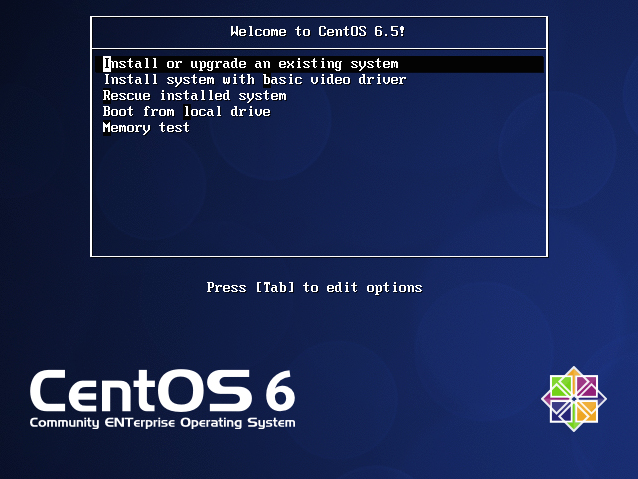
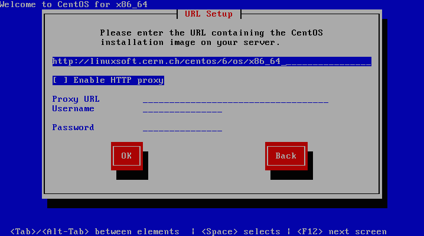

Download
--------

Latest image is **CentOS 6.5 (custom build v7) - Sep 25, 2014**:

* [Download image](http://personalpages.to.infn.it/~berzano/cloud-images/CentOS65-x86_64-build7-compat0.10.qcow2) (~700 MB)
* [GPG signature](http://personalpages.to.infn.it/~berzano/cloud-images/CentOS65-x86_64-build7-compat0.10.qcow2.sig)


### Features

* Minimal **[CentOS](http://www.centos.org/) 6 x86_64** installation
* **qcow2** format, v0.10
* **Single root partition** (no swap) that **automatically grows** to
  the full backing block device where applicable (*e.g.* virtual
  machines on LVM logical volumes)
* **[cloud-init](http://cloudinit.readthedocs.org/en/latest/) v0.7.4**
  (configured with support for EC2 metadata server, packages
  installation, Yum repository addition, mount points manipulation)
* **[CernVM-FS](http://cernvm.cern.ch/portal/startcvmfs) v2.1.19**
  (unconfigured and disabled by default)
* **[HTCondor](http://research.cs.wisc.edu/htcondor/) v8.2.2**
  (unconfigured and disabled by default)
* **EPEL 6.8**

> **Caveat!** Image comes with a default root password *(pippo123)*: it
> can be disabled during contextualization as explained below.


### Verify image

To verify the GPG signature, you need to trust the following key:

* [My GPG key](http://pgp.mit.edu:11371/pks/lookup?op=get&search=0xBFF76234)

Image and signature must be in the same directory. Run from a
terminal:

```console
$> gpg --verify <FileName>.qcow2.sig
gpg: Signature made <FullDateHere> using DSA key ID BFF76234
gpg: Good signature from "Dario Berzano <FullEmailHere>"
```

**OS X users:** if you have [GPG Tools](https://gpgtools.org/) simply
double-click the signature file from the Finder to verify it.

> Do not use the image if signature verification fails!


How the image was created
-------------------------

Image has been created on OS X using VMWare Fusion, but these
instructions can be adapted to whatever hosting operating system and
whatever hypervisor you use.

If you do not trust the ready-to-go cloud image, or you are simply
curious, you can go through the instructions yourself.


### Virtual machine creation

With VMWare Fusion, we create a new Virtual Machine with:

* a single disk, 20 GB, not preallocated
* networking with NAT on a single network interface
* audio, bluetooth, printers sharing disabled

Through the Wizard we install CentOS via the "netinstall" image:

* [Direct download of netinstall iso for CentOS 6.5](http://linuxsoft.cern.ch/centos/6.5/isos/x86_64/CentOS-6.5-x86_64-netinstall.iso)

Other CentOS install images are available
[here](http://linuxsoft.cern.ch/centos/6.5/isos/x86_64/).


### Installation

As soon as you boot the iso, the following screen will appear: proceed
to the installation:



When prompted, select the software source to:

```
http://linuxsoft.cern.ch/centos/6/os/x86_64
```



**Use the default installation options as much as possible.**

Change only the following things:

* use Etc/UTC as timezone
* turn off IPv6 (unless you need it)
* set "pippo123" as dummy root password


#### Disk layouts

Do not use LVM and do not create any swap partition. Create a single
partition with the **ext4** filesystem mounted as the root partition,
and tell CentOS to fill partition to the maximum allowable size:


#### Packages customization

Do not install any specific package, just the "minimal" set: when you
have finished, non-interactive installation begins.

At the end of the installation the VM reboots.

> With VMWare the VM may appear stuck after rebooting. This is a known
> bug: **pause and unpause** the VM to unfreeze the screen.


### Image customization

After booting the image we can customize it.


#### Network interface

Remove any reference of MAC addresses from the network configuration,
enable DHCP, disable NetworkManager and make the DHCP client retry
forever if no address is assigned. Do all of this by running:

```bash
cat > /etc/sysconfig/network-scripts/ifcfg-eth0 <<\EoF
TYPE=Ethernet
DEVICE=eth0
ONBOOT=yes
BOOTPROTO=dhcp
NM_CONTROLLED=no
PERSISTENT_DHCLIENT=1
EoF
```

To avoid problems with EC2 metadata servers, add the following line
to **/etc/sysconfig/network**:

```bash
NOZERCONF=yes
```

Restart networking to test:

```bash
service network restart
```


#### Install extra repositories

[EPEL](https://fedoraproject.org/wiki/EPEL/): get the latest RPM from
[here](http://mirror.switch.ch/ftp/mirror/epel/6/i386/repoview/epel-release.html)
and install it to enable the repository.

For instance, for EPEL version 6.8:

```bash
yum install -y http://mirror.switch.ch/ftp/mirror/epel/6/i386/epel-release-6-8.noarch.rpm
```

Also install extra repositories for
[HTCondor](http://research.cs.wisc.edu/htcondor/) and
[CernVM-FS](http://cernvm.cern.ch/portal/startcvmfs).

For HTCondor create **/etc/yum.repos.d/htcondor.repo**:

```ini
[htcondor]
name=HTCondor Stable RPM Repository for Redhat Enterprise Linux 6
baseurl=http://research.cs.wisc.edu/htcondor/yum/stable/rhel$releasever
enabled=1
gpgcheck=0
```

For CernVM-FS create **/etc/yum.repos.d/cvmfs.repo**:

```ini
[cvmfs]
name=CernVM-FS Stable
baseurl=http://cvmrepo.web.cern.ch/cvmrepo/yum/cvmfs/EL/$releasever/$basearch
enabled=1
gpgcheck=0
```

> We are using the "stable" repositories for both HTCondor and
> CernVM-FS.


#### Upgrade your system

**Before you install any extra package**, immediately upgrade the
system:

```bash
yum -y distro-sync
yum -y upgrade
```

Reboot when finished (not needed if kernel did not change):

```bash
reboot
```

#### Extra packages

Install some base extra packages:

```bash
yum install -y cloud-utils cloud-init parted git vim-enhanced
```

Install the following packages required by ALICE (*i.e.* without them,
ALICE software will **not** run): this is the
[minimal list](http://alien2.cern.ch/index.php?option=com_content&view=article&id=134:cvmfs&catid=7&Itemid=140):

```bash
yum install gcc gcc-c++ gcc-gfortran libXpm compat-libgfortran-41 redhat-lsb-core tcl compat-libtermcap
```

If you want to play safe, install a WLCG metapackage with all required
stuff for all LHC experiments:

```bash
yum install -y http://linuxsoft.cern.ch/wlcg/sl6/x86_64/HEP_OSlibs_SL6-1.0.16-0.el6.x86_64.rpm
```

This is a superset of the minimal list provided above. The CentOS
image ready to download has such metapackages installed.

> **Beware:** this metapackage **increases the image size of ~50%!**

Install HTCondor and CernVM-FS:

```bash
yum install -y condor cvmfs
```

Disable them (we can enable them if we need them during
contextualization):

```
chkconfig condor off
chkconfig autofs off
```

**Note:** we disable autofs to disable CernVM-FS automounting.

Check if they are disabled:

```console
$> chkconfig | grep -E 'condor|autofs'
autofs              0:off     1:off     2:off     3:off     4:off     5:off     6:off
condor              0:off     1:off     2:off     3:off     4:off     5:off     6:off
```

#### Automatically growing root partition

If running the virtual machine from a virtual disk stored on a block
device and not on a file (such as a LVM logical volume), we want the
virtual disk to grow up to the maximum disk space.

Although several modules for resizing partitions exist for cloud-init,
the only way to resize the root partition without rebooting is by
doing it before the root filesystem is mounted, *i.e.* from the
"initial ramdisk".

[Smart people](https://github.com/flegmatik/)
have written
[the machinery to do that](https://github.com/flegmatik/linux-rootfs-resize.git).

Here is how we enable our initrd to grow:

```bash
cd /tmp
git clone https://github.com/flegmatik/linux-rootfs-resize.git
cd linux-rootfs-resize
./install
```

**Note:** we are downloading the HEAD of the Git master by default. In
case of problems, the latest tested hash that has proven to
work with our custom virtual machine is
[08f06bf5d9](https://github.com/flegmatik/linux-rootfs-resize/tree/08f06bf5d90bba5d655bf860786b5b58a790ef07).


#### cloud-init configuration

Let's edit **/etc/cloud/cloud.cfg** and make sure the following
modules, datasources, etc. are present (just **add** them to the
relevant sections, **do not** replace the file with this one):

```yaml
disable_root: 1
ssh_pwauth:   0

datasource_list: [ 'Ec2', 'OpenNebula' ]

datasource:
  # case-sensitive!
  Ec2:
    max_wait: 20
    timeout: 20

cloud_config_modules:
 - mounts
 - yum_add_repo
 - package_update_upgrade_install

system_info:
  default_user:
    sudo: ALL=(ALL) NOPASSWD:ALL
```

We have enabled modules for mounting filesystems, adding repositories
and installing/upgrading packages.

Moreover, the default user "cloud-user" will have `sudo` permissions
without password.


#### Clean up before shutting down

Inspired from [here](http://libguestfs.org/virt-sysprep.1.html#operations).

```bash
rm -rf /var/spool/abrt/*
unset HISTFILE

rm -f /root/.bash_history /home/*/.bash_history
rm -f /var/lib/dhclient/*
rm -f /etc/sysconfig/iptables
service iptables restart
rm -rf /var/cache/yum/*
rm -rf /root/.ssh/ /home/*/.ssh/

echo -n '' > /etc/udev/rules.d/75-persistent-net-generator.rules
echo -n '' > /etc/udev/rules.d/70-persistent-net.rules

rm -f /etc/ssh/ssh_*_key
rm -rf /var/lib/cloud
rm -rf /tmp/*
userdel -frZ cloud-user

rm -rf \
  /etc/Pegasus/*.cnf \
  /etc/Pegasus/*.crt \
  /etc/Pegasus/*.csr \
  /etc/Pegasus/*.pem \
  /etc/Pegasus/*.srl \
  /root/anaconda-ks.cfg \
  /root/anaconda-post.log \
  /root/initial-setup-ks.cfg \
  /root/install.log \
  /root/install.log.syslog \
  /var/cache/fontconfig/* \
  /var/cache/gdm/* \
  /var/cache/man/* \
  /var/lib/AccountService/users/* \
  /var/lib/fprint/* \
  /var/lib/logrotate.status \
  /var/log/*.log* \
  /var/log/BackupPC/LOG \
  /var/log/ConsoleKit/* \
  /var/log/anaconda.syslog \
  /var/log/anaconda/* \
  /var/log/apache2/*_log \
  /var/log/apache2/*_log-* \
  /var/log/apt/* \
  /var/log/aptitude* \
  /var/log/audit/* \
  /var/log/btmp* \
  /var/log/ceph/*.log \
  /var/log/chrony/*.log \
  /var/log/cron* \
  /var/log/cups/*_log \
  /var/log/debug* \
  /var/log/dmesg* \
  /var/log/exim4/* \
  /var/log/faillog* \
  /var/log/gdm/* \
  /var/log/glusterfs/*glusterd.vol.log \
  /var/log/glusterfs/glusterfs.log \
  /var/log/httpd/*log \
  /var/log/installer/* \
  /var/log/jetty/jetty-console.log \
  /var/log/journal/* \
  /var/log/lastlog* \
  /var/log/libvirt/libvirtd.log \
  /var/log/libvirt/lxc/*.log \
  /var/log/libvirt/qemu/*.log \
  /var/log/libvirt/uml/*.log \
  /var/log/lightdm/* \
  /var/log/mail/* \
  /var/log/maillog* \
  /var/log/messages* \
  /var/log/ntp \
  /var/log/ntpstats/* \
  /var/log/ppp/connect-errors \
  /var/log/rhsm/* \
  /var/log/sa/* \
  /var/log/secure* \
  /var/log/setroubleshoot/*.log \
  /var/log/spooler* \
  /var/log/squid/*.log \
  /var/log/syslog* \
  /var/log/tallylog* \
  /var/log/tuned/tuned.log \
  /var/log/wtmp* \
  /var/named/data/named.run \
  /var/log/cloud-init.log
```

**Note:** it is recommended to create under the root user a script
with the above content, to re-run every time you upgrade the image.

At this point you can shut down:

```bash
halt
```

> If you boot the image by accident, you have to **clean it up again**
> before saving it!


### Converting the image to qcow2

Take a VMWare snapshot just in case: we will restart from there in
case of problems.

VMWare saves everything under *bundles*, seen as normal directories
if using a terminal:

```bash
cd '/Users/myuser/Virtual Machines/CentOS, 64 bit.vmwarevm'
```

Disks have extension `.vmdk`. Every disk is split in several files:
moreover, a set of split files exists per snapshot.

So, for instance:

```
$> ls -l *.vmdk
Disk-000001-s001.vmdk
Disk-000001-s002.vmdk
Disk-000001-s003.vmdk
Disk-000001-s004.vmdk
Disk-000001-s005.vmdk
Disk-000001-s006.vmdk
Disk-000001-s007.vmdk
Disk-000001-s008.vmdk
Disk-000001-s009.vmdk
Disk-000001-s010.vmdk
Disk-000001-s011.vmdk
Disk-000001.vmdk
Disk-000002-s001.vmdk
Disk-000002-s002.vmdk
Disk-000002-s003.vmdk
Disk-000002-s004.vmdk
Disk-000002-s005.vmdk
Disk-000002-s006.vmdk
Disk-000002-s007.vmdk
Disk-000002-s008.vmdk
Disk-000002-s009.vmdk
Disk-000002-s010.vmdk
Disk-000002-s011.vmdk
Disk-000002.vmdk
Disk-s001.vmdk
Disk-s002.vmdk
Disk-s003.vmdk
Disk-s004.vmdk
Disk-s005.vmdk
Disk-s006.vmdk
Disk-s007.vmdk
Disk-s008.vmdk
Disk-s009.vmdk
Disk-s010.vmdk
Disk-s011.vmdk
Disk.vmdk
```

means that we have three disk sets:

* `Disk.vmdk` (and `Disk-s??.vmdk`) is the current working copy
* `Disk-000001.vmdk` (and `Disk-000001-s??.vmdk`) is the oldest
  snapshot
* `Disk-000002.vmdk` (and `Disk-000002-s??.vmdk`) is the most recent
  snapshot

Since we have just taken a snapshot, we are interested in converting
the following disk: `Disk-000002.vmdk`.

We must have `qemu-img` installed on OS X. To install it (with
[Homebrew](http://brew.sh/)):

```bash
brew install qemu
```

To convert:

```bash
qemu-img convert \
  -O qcow2 \
  -c \
  -o compat=0.10 \
  'Disk-000002.vmdk' \
  CentOS65-x86_64-build<N>-compat0.10.qcow2
```

To sign with GPG:

```bash
gpg --detach-sign CentOS65-x86_64-build<N>-compat0.10.qcow2
```

A binary file named `CentOS65-x86_64-build<N>-compat0.10.qcow2.sig`
will be created and must be distributed along with the image.

Notes:

* We use **qcow2 v0.10** (instead of the latest) for **compatibility**
  with the qemu version running on CentOS 6 hypervisors: you might not
  need it.
* The `-c` option makes smaller images ("compress").
* Our convention is incrementing the build number `<N>` by 1 every
  time we release a new image version.


### Upgrading an existing image

Boot the existing image from VMWare: since we have created snapshots
we can always revert if something went wrong.

Log in and repeat the [upgrade procedure](#upgrade_your_system).

If kernel version changed, reboot the VM, log in again and
[reinstall support for growing root partition](#automatically_growing_root_partition).

Then [clean everything up](#clean_up_before_shutting_down) and halt:
the upgraded image is ready to be converted and distributed.
